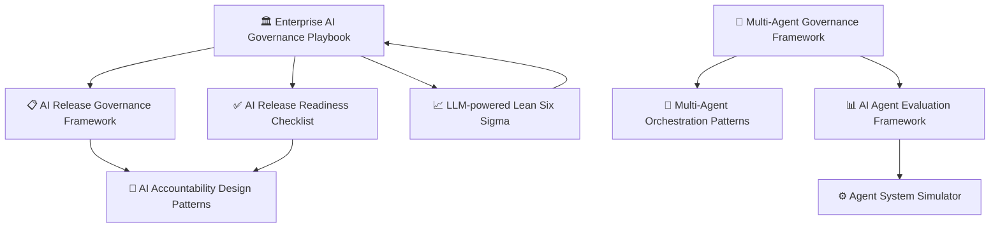

# Hi, I'm Sima Bagheri 👋

**AI Platforms · Governance · Release Readiness · Reliability in Regulated Systems**

---

I work at the intersection of AI systems and operational rigor — designing frameworks, tools, and patterns for teams building AI in regulated or safety-critical environments.

My focus: making AI systems **releasable**, **accountable**, and **governable** — not just capable.

---

## The Ecosystem

The repositories below form a connected toolkit for responsible AI operations — from intake to continuous improvement:

---

## Featured Repositories

| Area | Repository | What it solves |
|------|-----------|----------------|
| 🏛️ Enterprise | [Enterprise AI Governance Playbook](https://github.com/simaba/enterprise-ai-governance-playbook) | End-to-end AI operating model from intake to improvement |
| 📋 Release | [AI Release Governance Framework](https://github.com/simaba/ai-release-governance-framework) | Risk-based release gates for AI systems in regulated environments |
| ✅ Release | [AI Release Readiness Checklist](https://github.com/simaba/ai-release-readiness-checklist) | Risk-tiered pre-release checklists with a CLI evaluation tool |
| 🤝 Accountability | [AI Accountability Design Patterns](https://github.com/simaba/ai-accountability-design-patterns) | Reusable patterns for human oversight in AI-enabled systems |
| 🤖 Agents | [Multi-Agent Governance Framework](https://github.com/simaba/multi-agent-governance-framework) | Roles, authority, escalation logic for agent systems |
| 🔄 Agents | [Multi-Agent Orchestration Patterns](https://github.com/simaba/multi-agent-orchestration-patterns) | Sequential, parallel, feedback-loop, and fallback patterns |
| 📊 Evaluation | [AI Agent Evaluation Framework](https://github.com/simaba/ai-agent-evaluation-framework) | System-level evaluation across correctness, latency, cost |
| ⚙️ Code | [Agent System Simulator](https://github.com/simaba/agent-system-simulator) | Runnable multi-agent simulator with governance controls |
| 📈 Improvement | [LLM-powered Lean Six Sigma](https://github.com/simaba/LLM-powered-Lean-Six-Sigma) | AI copilot for DMAIC frameworks and statistical analysis |

---

## Current focus

- AI governance and release discipline for regulated environments
- Multi-agent system design and control patterns
- Applying Lean Six Sigma thinking to AI operations

---

*All repositories are shared in a personal capacity. Questions and collaborations welcome.*

## New in Phase 2

| Governance Resources | [awesome-ai-governance](https://github.com/simaba/awesome-ai-governance) | Curated list of 50+ AI governance frameworks, tools, and regulations |
| Starter Template | [regulated-ai-starter-kit](https://github.com/simaba/regulated-ai-starter-kit) | Template repo for regulated-industry AI teams — governance docs + CI out of the box |
| NIST AI RMF Guide | [nist-ai-rmf-implementation-guide](https://github.com/simaba/nist-ai-rmf-implementation-guide) | Practitioner implementation guide for NIST AI RMF with code examples and EU AI Act mapping |
