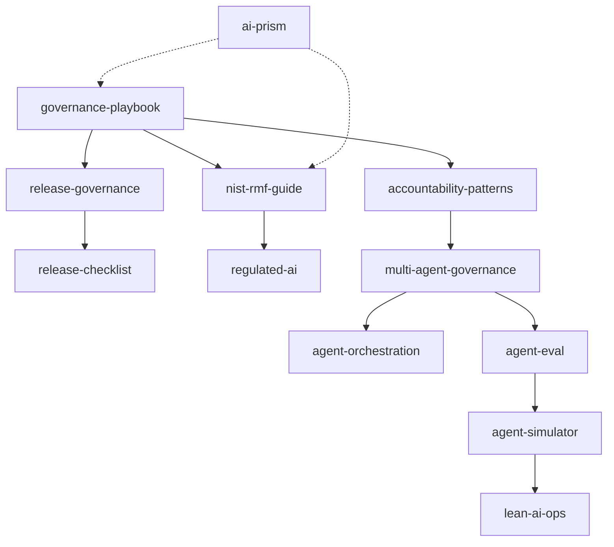

# Hi, I'm Sima Bagheri

**AI governance | release readiness | enterprise AI operating models | multi-agent systems | process excellence**

I build open-source repositories around trustworthy, auditable AI for regulated and high-accountability environments.

[](https://www.linkedin.com/in/simaba/)
[](https://medium.com/@bagheri.sima)
[](https://airc.nist.gov/home)

## Start here

If you want to know where to begin, use this guide:

| Goal | Start with |
|---|---|
| Understand the full operating model for enterprise AI | [`governance-playbook`](https://github.com/simaba/governance-playbook) |
| Validate AI release readiness with a working CLI | [`release-checklist`](https://github.com/simaba/release-checklist) |
| Understand release-stage governance | [`release-governance`](https://github.com/simaba/release-governance) |
| Apply NIST AI RMF in practice | [`nist-rmf-guide`](https://github.com/simaba/nist-rmf-guide) |
| Start a new regulated-AI repo from a template | [`regulated-ai`](https://github.com/simaba/regulated-ai) |
| Explore multi-agent governance and control patterns | [`multi-agent-governance`](https://github.com/simaba/multi-agent-governance) |
| See runnable multi-agent behavior in code | [`agent-simulator`](https://github.com/simaba/agent-simulator) |
| Use AI for structured process-improvement work | [`lean-ai-ops`](https://github.com/simaba/lean-ai-ops) |
| Browse curated governance resources | [`ai-prism`](https://github.com/simaba/ai-prism) |

## Portfolio map by artifact type

### Working tools and apps

| Repository | Type | What it does |
|---|---|---|
| [`release-checklist`](https://github.com/simaba/release-checklist) | CLI | Validates YAML-based release-readiness configurations |
| [`agent-simulator`](https://github.com/simaba/agent-simulator) | Runnable demo | Simulates bounded multi-agent workflows |
| [`lean-ai-ops`](https://github.com/simaba/lean-ai-ops) | Streamlit app | Generates DMAIC-style improvement packages with analytics |

### Frameworks and practitioner guides

| Repository | Type | What it does |
|---|---|---|
| [`governance-playbook`](https://github.com/simaba/governance-playbook) | Playbook | End-to-end AI operating model |
| [`release-governance`](https://github.com/simaba/release-governance) | Framework | Release lifecycle governance and gates |
| [`nist-rmf-guide`](https://github.com/simaba/nist-rmf-guide) | Guide | Practitioner implementation guide for NIST AI RMF |
| [`accountability-patterns`](https://github.com/simaba/accountability-patterns) | Pattern catalog | Accountability, oversight, and redress patterns |
| [`multi-agent-governance`](https://github.com/simaba/multi-agent-governance) | Framework | Trust, oversight, and accountability for multi-agent systems |
| [`agent-orchestration`](https://github.com/simaba/agent-orchestration) | Pattern catalog | Routing, delegation, validation, and failure-handling patterns |
| [`agent-eval`](https://github.com/simaba/agent-eval) | Evaluation framework | Agent evaluation dimensions, scenarios, and reporting structure |

### Templates and reference hubs

| Repository | Type | What it does |
|---|---|---|
| [`regulated-ai`](https://github.com/simaba/regulated-ai) | Template repo | Governance docs, release stubs, and starter workflows |
| [`ai-prism`](https://github.com/simaba/ai-prism) | Reference hub | Curated governance frameworks, tools, standards, and papers |

## How the repos fit together



## Design principles across the portfolio

- **clear artifact types** so tools, frameworks, templates, and references are not confused
- **truthful maturity labels** so prototypes are not presented as finished products
- **practical usefulness** over theory for its own sake
- **traceability and accountability** wherever decisions, gates, or evaluations are involved

## Featured command-line quick start

```bash
git clone https://github.com/simaba/release-checklist.git
cd release-checklist
python -m pip install -e .
release-checklist init --industry healthcare
release-checklist validate configs/medium-risk-example.yaml
release-checklist report configs/medium-risk-example.yaml --format markdown
```

*Most repositories are MIT licensed. `ai-prism` is released under CC0.*
