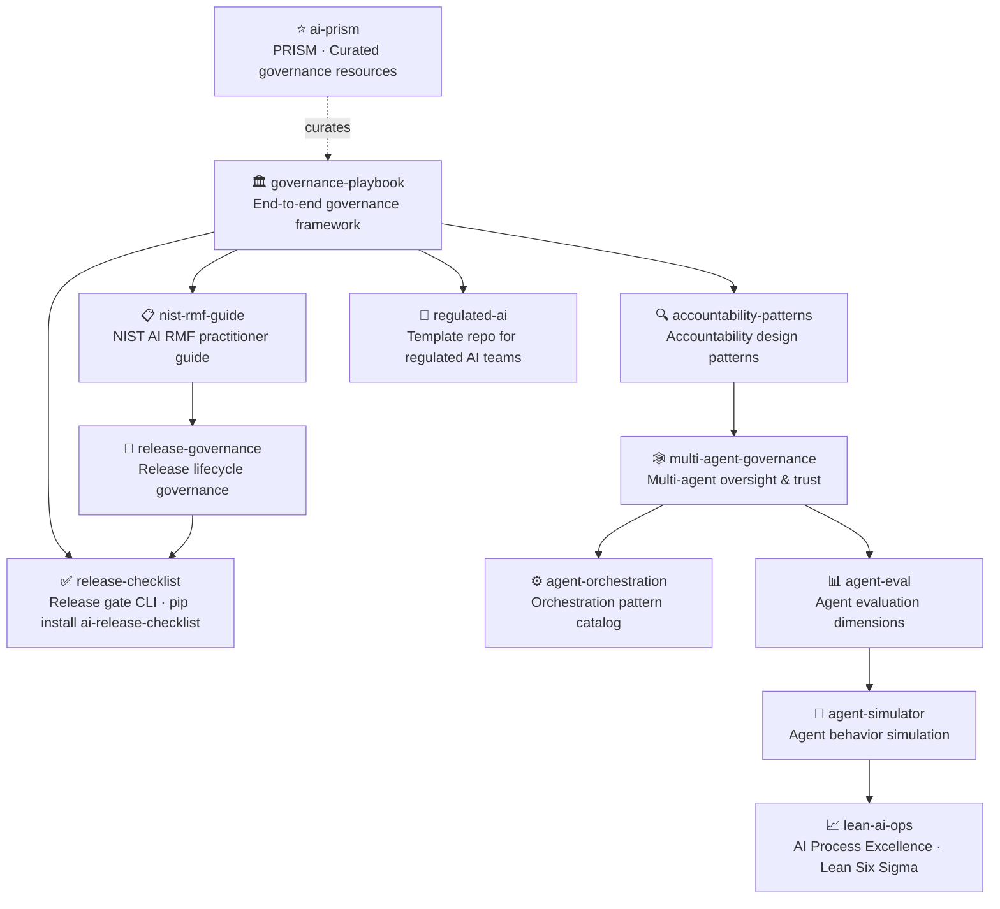

# Hi, I'm Sima Bagheri 👋

**AI Governance · Release Readiness · Enterprise AI Platforms · Multi-Agent Systems**

Building trustworthy, auditable AI for regulated industries — healthcare, financial services, insurance, and government.

[](https://www.linkedin.com/in/simaba/)
[](https://medium.com/@bagheri.sima)
[](https://airc.nist.gov/home)

---

## The Ecosystem

All repositories form an interconnected governance and reliability framework:



---

## Featured Repositories

### Governance & Risk

| Area | Repository | What it solves |
|---|---|---|
| Organizational Governance | [governance-playbook](https://github.com/simaba/governance-playbook) | End-to-end AI governance framework — policies, roles, NIST AI RMF implementation |
| NIST AI RMF | [nist-rmf-guide](https://github.com/simaba/nist-rmf-guide) | Practitioner guide to NIST AI RMF with EU AI Act cross-reference |
| Accountability | [accountability-patterns](https://github.com/simaba/accountability-patterns) | Design patterns for human oversight, transparency, and redress |

### Release & Deployment

| Area | Repository | What it solves |
|---|---|---|
| Release Gates | [release-checklist](https://github.com/simaba/release-checklist) | YAML-based release checklist + `airc` CLI · `pip install ai-release-checklist` |
| Release Lifecycle | [release-governance](https://github.com/simaba/release-governance) | Full release lifecycle governance — from development through retirement |
| Starter Template | [regulated-ai](https://github.com/simaba/regulated-ai) | GitHub template: governance docs + CI gates ready to use |

### Multi-Agent & Evaluation

| Area | Repository | What it solves |
|---|---|---|
| Multi-Agent Governance | [multi-agent-governance](https://github.com/simaba/multi-agent-governance) | Oversight, trust models, and accountability for multi-agent AI |
| Orchestration | [agent-orchestration](https://github.com/simaba/agent-orchestration) | Routing, delegation, validation, and failure handling patterns |
| Agent Evaluation | [agent-eval](https://github.com/simaba/agent-eval) | Evaluation dimensions and scenarios for production AI agents |
| Simulation | [agent-simulator](https://github.com/simaba/agent-simulator) | Simulate agent behavior and failure modes before deployment |
| Process Excellence | [lean-ai-ops](https://github.com/simaba/lean-ai-ops) | AI Process Excellence Engine — DMAIC with Black Belt analytics |

### Resources

| Area | Repository | What it solves |
|---|---|---|
| Curated Resources | [ai-prism](https://github.com/simaba/ai-prism) | PRISM — 50+ curated governance frameworks, tools, regulations, and communities |

---

## Open-Source Tools

```bash
# Validate AI release readiness from the command line
pip install ai-release-checklist

airc init --industry healthcare     # Generate a HIPAA-aware checklist
airc validate release-checklist.yaml  # Check all gates
airc report release-checklist.yaml --format markdown  # Generate report
```

---

*Building in the open. All frameworks are MIT licensed and free to use.*
*[Discussions](https://github.com/simaba/governance-playbook/discussions) · [LinkedIn](https://www.linkedin.com/in/simaba/) · [Medium](https://medium.com/@bagheri.sima)*
