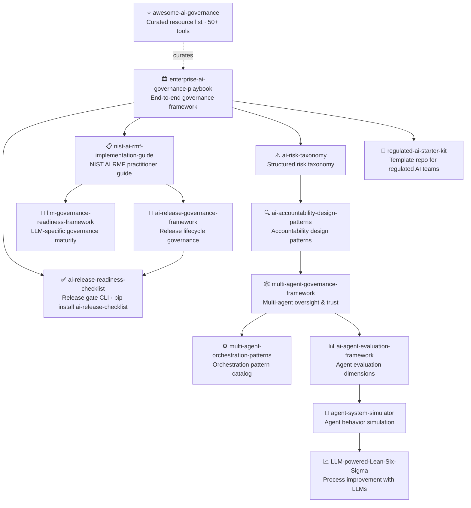

# Hi, I'm Sima Bagheri 👋

**AI Governance · Release Readiness · Enterprise AI Platforms · Multi-Agent Systems**

Building trustworthy, auditable AI for regulated industries — healthcare, financial services, insurance, and government.

[](https://www.linkedin.com/in/simabagheri)
[](https://medium.com/@simabagheri)
[](https://airc.nist.gov/home)

---

## The Ecosystem

All repositories form an interconnected governance and reliability framework:



---

## Featured Repositories

### Governance & Risk

| Area | Repository | What it solves |
|---|---|---|
| Organizational Governance | [enterprise-ai-governance-playbook](https://github.com/simaba/enterprise-ai-governance-playbook) | End-to-end AI governance framework — policies, roles, NIST AI RMF implementation |
| NIST AI RMF | [nist-ai-rmf-implementation-guide](https://github.com/simaba/nist-ai-rmf-implementation-guide) | Practitioner guide to NIST AI RMF with EU AI Act cross-reference |
| Risk Management | [ai-risk-taxonomy](https://github.com/simaba/ai-risk-taxonomy) | Structured risk taxonomy mapped to NIST AI RMF and EU AI Act |
| Accountability | [ai-accountability-design-patterns](https://github.com/simaba/ai-accountability-design-patterns) | Design patterns for human oversight, transparency, and redress |

### Release & Deployment

| Area | Repository | What it solves |
|---|---|---|
| Release Gates | [ai-release-readiness-checklist](https://github.com/simaba/ai-release-readiness-checklist) | YAML-based release checklist + `airc` CLI · `pip install ai-release-checklist` |
| Release Lifecycle | [ai-release-governance-framework](https://github.com/simaba/ai-release-governance-framework) | Full release lifecycle governance — from development through retirement |
| Starter Template | [regulated-ai-starter-kit](https://github.com/simaba/regulated-ai-starter-kit) | GitHub template: governance docs + CI gates ready to use |
| LLM Governance | [llm-governance-readiness-framework](https://github.com/simaba/llm-governance-readiness-framework) | LLM-specific governance maturity framework mapped to NIST AI RMF |

### Multi-Agent & Evaluation

| Area | Repository | What it solves |
|---|---|---|
| Multi-Agent Governance | [multi-agent-governance-framework](https://github.com/simaba/multi-agent-governance-framework) | Oversight, trust models, and accountability for multi-agent AI |
| Orchestration | [multi-agent-orchestration-patterns](https://github.com/simaba/multi-agent-orchestration-patterns) | Routing, delegation, validation, and failure handling patterns |
| Agent Evaluation | [ai-agent-evaluation-framework](https://github.com/simaba/ai-agent-evaluation-framework) | Evaluation dimensions and scenarios for production AI agents |
| Simulation | [agent-system-simulator](https://github.com/simaba/agent-system-simulator) | Simulate agent behavior and failure modes before deployment |
| Process Improvement | [LLM-powered-Lean-Six-Sigma](https://github.com/simaba/LLM-powered-Lean-Six-Sigma) | LLM agents for DMAIC process improvement workflows |

### Resources

| Area | Repository | What it solves |
|---|---|---|
| Curated List | [awesome-ai-governance](https://github.com/simaba/awesome-ai-governance) | 50+ curated frameworks, tools, regulations, papers, and communities |

---

## Open-Source Tools

```bash
# Validate AI release readiness from the command line
pip install ai-release-checklist

airc init --industry healthcare     # Generate a HIPAA-aware checklist
airc validate release-checklist.yaml  # Check all gates
airc report release-checklist.yaml --format markdown  # Generate report
```

---

*Building in the open. All frameworks are MIT licensed and free to use.*
*[Discussions](https://github.com/simaba/enterprise-ai-governance-playbook/discussions) · [LinkedIn](https://www.linkedin.com/in/simabagheri) · [Medium](https://medium.com/@simabagheri)*
