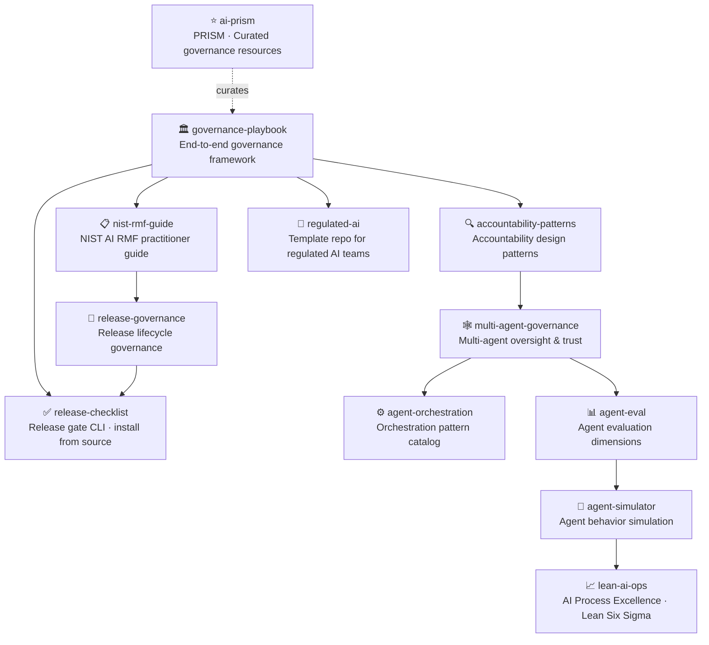

# Hi, I'm Sima Bagheri 👋

**AI Governance · Release Readiness · Enterprise AI Platforms · Multi-Agent Systems**

Building trustworthy, auditable AI for regulated industries including healthcare, financial services, insurance, and government.

[](https://www.linkedin.com/in/simaba/)
[](https://medium.com/@bagheri.sima)
[](https://airc.nist.gov/home)

---

## The ecosystem

These repositories are designed as a connected governance and reliability toolkit.
Some are **working tools**, some are **frameworks and templates**, and some are **curated references**.



---

## Featured repositories

### Governance & Risk

| Area | Repository | Maturity | What it solves |
|---|---|---|---|
| Organizational Governance | [governance-playbook](https://github.com/simaba/governance-playbook) | Framework | End-to-end AI governance framework with policy, intake, prioritization, and improvement loops |
| NIST AI RMF | [nist-rmf-guide](https://github.com/simaba/nist-rmf-guide) | Guide | Practitioner guide to NIST AI RMF with EU AI Act and ISO cross-reference |
| Accountability | [accountability-patterns](https://github.com/simaba/accountability-patterns) | Pattern catalog | Design patterns for human oversight, transparency, and redress |

### Release & Deployment

| Area | Repository | Maturity | What it solves |
|---|---|---|---|
| Release Gates | [release-checklist](https://github.com/simaba/release-checklist) | Working CLI | YAML-based release checklist with a packaged `release-checklist` validator |
| Release Lifecycle | [release-governance](https://github.com/simaba/release-governance) | Framework | Release lifecycle governance from development through retirement |
| Starter Template | [regulated-ai](https://github.com/simaba/regulated-ai) | Template repo | Governance docs, release stubs, and CI workflows ready to adapt |

### Multi-Agent & Evaluation

| Area | Repository | Maturity | What it solves |
|---|---|---|---|
| Multi-Agent Governance | [multi-agent-governance](https://github.com/simaba/multi-agent-governance) | Framework | Oversight, trust models, and accountability for multi-agent AI |
| Orchestration | [agent-orchestration](https://github.com/simaba/agent-orchestration) | Pattern catalog | Routing, delegation, validation, and failure-handling patterns |
| Agent Evaluation | [agent-eval](https://github.com/simaba/agent-eval) | Framework | Evaluation dimensions and scenarios for production AI agents |
| Simulation | [agent-simulator](https://github.com/simaba/agent-simulator) | Working demo | Simulate agent behavior and failure modes before deployment |
| Process Excellence | [lean-ai-ops](https://github.com/simaba/lean-ai-ops) | Working app | AI Process Excellence engine with DMAIC workflow and analytics |

### Resources

| Area | Repository | Maturity | What it solves |
|---|---|---|---|
| Curated Resources | [ai-prism](https://github.com/simaba/ai-prism) | Reference hub | Curated governance frameworks, tools, regulations, and communities |

---

## Open-source tools

```bash
# Validate AI release readiness from the command line
git clone https://github.com/simaba/release-checklist.git
cd release-checklist
python -m pip install -e .
release-checklist init --industry healthcare
release-checklist validate configs/medium-risk-example.yaml
release-checklist report configs/medium-risk-example.yaml --format markdown
```

---

*Building in the open. Most repositories are MIT licensed. `ai-prism` is released under CC0.*
*[Discussions](https://github.com/simaba/governance-playbook/discussions) · [LinkedIn](https://www.linkedin.com/in/simaba/) · [Medium](https://medium.com/@bagheri.sima)*
