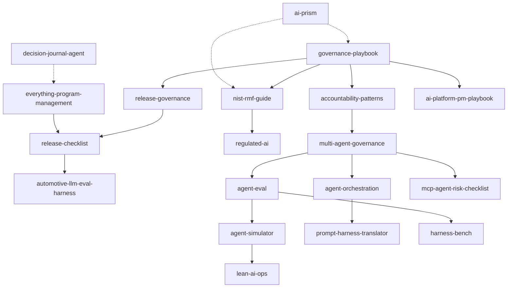

# Hi, I'm Sima Bagheri

**AI governance | release readiness | enterprise AI operating models | multi-agent systems | process excellence**

I build open-source repositories around trustworthy, auditable AI for regulated and high-accountability environments.

[](https://www.linkedin.com/in/simaba/)
[](https://medium.com/@bagheri.sima)
[](https://airc.nist.gov/home)

## Featured work

A deliberately small set of starting points across the portfolio:

| Track | Start with | What it demonstrates |
|---|---|---|
| **Flagship working tools** | [`release-checklist`](https://github.com/simaba/release-checklist), [`automotive-llm-eval-harness`](https://github.com/simaba/automotive-llm-eval-harness), [`lean-ai-ops`](https://github.com/simaba/lean-ai-ops) | Release evidence validation, synthetic LLM evaluation, and structured continuous improvement |
| **Program-management toolkit** | [`everything-program-management`](https://github.com/simaba/everything-program-management) | Reusable agents, templates, examples, schemas, and a lightweight validation CLI |
| **Emerging engineering experiments** | [`agent-simulator`](https://github.com/simaba/agent-simulator), [`prompt-harness-translator`](https://github.com/simaba/prompt-harness-translator), [`harness-bench`](https://github.com/simaba/harness-bench), [`decision-journal-agent`](https://github.com/simaba/decision-journal-agent) | Bounded multi-agent behavior, prompt portability, transparent benchmark scoring, and decision review workflows |
| **Practitioner frameworks** | [`governance-playbook`](https://github.com/simaba/governance-playbook), [`agent-eval`](https://github.com/simaba/agent-eval), [`ai-platform-pm-playbook`](https://github.com/simaba/ai-platform-pm-playbook) | AI operating models, agent evaluation, and AI-platform product management |
| **Risk and controls** | [`ai-act-compliance-agents`](https://github.com/simaba/ai-act-compliance-agents), [`mcp-agent-risk-checklist`](https://github.com/simaba/mcp-agent-risk-checklist), [`multi-agent-governance`](https://github.com/simaba/multi-agent-governance) | Traceability, agent-tool risk review, oversight, and accountability |

## Portfolio guide

Use this guide to choose the right starting point:

| Goal | Start with | Maturity |
|---|---|---|
| Understand the full operating model for enterprise AI | [`governance-playbook`](https://github.com/simaba/governance-playbook) | Practitioner playbook |
| Validate AI release readiness with a working CLI | [`release-checklist`](https://github.com/simaba/release-checklist) | Alpha working tool |
| Evaluate synthetic LLM-powered in-vehicle assistant behavior | [`automotive-llm-eval-harness`](https://github.com/simaba/automotive-llm-eval-harness) | Working prototype |
| Build structured program-management artifacts and validate key fields | [`everything-program-management`](https://github.com/simaba/everything-program-management) | Foundation release |
| Understand release-stage governance | [`release-governance`](https://github.com/simaba/release-governance) | Framework |
| Apply NIST AI RMF in practice | [`nist-rmf-guide`](https://github.com/simaba/nist-rmf-guide) | Practitioner guide |
| Start a new regulated-AI repository from a template | [`regulated-ai`](https://github.com/simaba/regulated-ai) | Template repository |
| Explore multi-agent governance and control patterns | [`multi-agent-governance`](https://github.com/simaba/multi-agent-governance) | Framework |
| See runnable multi-agent behavior in code | [`agent-simulator`](https://github.com/simaba/agent-simulator) | Runnable demo |
| Review MCP server and agent-tool risk before integration | [`mcp-agent-risk-checklist`](https://github.com/simaba/mcp-agent-risk-checklist) | Initial review toolkit |
| Use AI for structured process-improvement work | [`lean-ai-ops`](https://github.com/simaba/lean-ai-ops) | Working app |
| Browse curated governance resources | [`ai-prism`](https://github.com/simaba/ai-prism) | Resource hub |

## Medium article map

My Medium articles describe operating problems in AI governance and delivery. These repositories translate those ideas into reusable artifacts, templates, and tools.

| Medium theme | Use this repository | Practical next step |
|---|---|---|
| Why AI governance fails in safety-critical or regulated systems | [`governance-playbook`](https://github.com/simaba/governance-playbook) | Adapt the operating-model template |
| AI release readiness as the missing operational layer | [`release-checklist`](https://github.com/simaba/release-checklist) | Run the sample YAML validator |
| Release gates as accountability and readiness controls | [`release-governance`](https://github.com/simaba/release-governance) | Compare the lifecycle gates with the CLI checks |
| Human-in-the-loop is not enough without ownership and redress | [`accountability-patterns`](https://github.com/simaba/accountability-patterns) | Fill the accountability matrix |
| AI roadmaps should be governed by risk, value, and execution reality | [`governance-playbook`](https://github.com/simaba/governance-playbook) | Use the intake and prioritization artifacts |
| EU AI Act and regulated-AI readiness | [`nist-rmf-guide`](https://github.com/simaba/nist-rmf-guide), [`regulated-ai`](https://github.com/simaba/regulated-ai), [`ai-prism`](https://github.com/simaba/ai-prism) | Start with a gap assessment and template kit |
| Multi-agent systems need control logic, evaluation, and escalation paths | [`multi-agent-governance`](https://github.com/simaba/multi-agent-governance), [`agent-eval`](https://github.com/simaba/agent-eval), [`agent-simulator`](https://github.com/simaba/agent-simulator) | Review the evaluation framework, then run the simulator |

## Portfolio map by artifact type

### Working tools and apps

| Repository | Type | What it does |
|---|---|---|
| [`release-checklist`](https://github.com/simaba/release-checklist) | CLI | Validates YAML-based release-readiness configurations |
| [`automotive-llm-eval-harness`](https://github.com/simaba/automotive-llm-eval-harness) | CLI | Scores synthetic LLM evaluation cases with safety/privacy hard gates |
| [`everything-program-management`](https://github.com/simaba/everything-program-management) | Toolkit + CLI | Produces and validates structured PM artifacts |
| [`agent-simulator`](https://github.com/simaba/agent-simulator) | Runnable demo | Simulates bounded multi-agent workflows |
| [`lean-ai-ops`](https://github.com/simaba/lean-ai-ops) | Streamlit app | Generates DMAIC-style improvement packages with analytics |
| [`decision-journal-agent`](https://github.com/simaba/decision-journal-agent) | CLI | Creates and reviews local Markdown decision-journal entries |
| [`prompt-harness-translator`](https://github.com/simaba/prompt-harness-translator) | CLI | Translates simple YAML-frontmatter agent Markdown to supported target formats |
| [`harness-bench`](https://github.com/simaba/harness-bench) | CLI | Scores normalized synthetic agent-harness run artifacts |

### Frameworks and practitioner guides

| Repository | Type | What it does |
|---|---|---|
| [`governance-playbook`](https://github.com/simaba/governance-playbook) | Playbook | End-to-end AI operating model |
| [`release-governance`](https://github.com/simaba/release-governance) | Framework | Release lifecycle governance and gates |
| [`nist-rmf-guide`](https://github.com/simaba/nist-rmf-guide) | Guide | Practitioner implementation guide for NIST AI RMF |
| [`accountability-patterns`](https://github.com/simaba/accountability-patterns) | Pattern catalog | Accountability, oversight, and redress patterns |
| [`multi-agent-governance`](https://github.com/simaba/multi-agent-governance) | Framework | Trust, oversight, and accountability for multi-agent systems |
| [`agent-orchestration`](https://github.com/simaba/agent-orchestration) | Pattern catalog | Routing, delegation, validation, and failure-handling patterns |
| [`agent-eval`](https://github.com/simaba/agent-eval) | Evaluation framework | Agent evaluation dimensions, scenarios, and reporting structure |
| [`ai-platform-pm-playbook`](https://github.com/simaba/ai-platform-pm-playbook) | Playbook | Templates and frameworks for AI-platform and agent-product work |
| [`ai-act-compliance-agents`](https://github.com/simaba/ai-act-compliance-agents) | Prototype toolkit | Structured traceability drafting and accountable-review support |
| [`mcp-agent-risk-checklist`](https://github.com/simaba/mcp-agent-risk-checklist) | Review toolkit | Structured risk review for MCP servers, tools, and agent integrations |

### Templates and reference hubs

| Repository | Type | What it does |
|---|---|---|
| [`regulated-ai`](https://github.com/simaba/regulated-ai) | Template repository | Governance docs, release stubs, and starter workflows |
| [`ai-prism`](https://github.com/simaba/ai-prism) | Reference hub | Curated governance frameworks, tools, standards, and papers |

## How the repositories fit together



## Design principles across the portfolio

- **clear artifact types** so tools, frameworks, templates, and references are not confused
- **truthful maturity labels** so prototypes are not presented as finished products
- **practical usefulness** over theory for its own sake
- **traceability and accountability** wherever decisions, gates, or evaluations are involved
- **evidence discipline** so claims, assumptions, and gaps are separated clearly

## Scope and disclaimer

These repositories are practitioner resources shared in a personal capacity. They are not legal advice, compliance certification, regulatory approval, safety certification, or official guidance from NIST, the EU, ISO, or any employer.

References to NIST AI RMF, EU AI Act, ISO/IEC 42001, and related standards are self-assessed, practitioner mappings. Always verify against official sources before using them for compliance, safety, or release decisions.

## Featured command-line example

```bash
git clone https://github.com/simaba/release-checklist.git
cd release-checklist
python -m pip install -e .
release-checklist init --industry healthcare
release-checklist validate configs/medium-risk-example.yaml
release-checklist report configs/medium-risk-example.yaml --format markdown
```

*Most repositories are MIT licensed. `ai-prism` is released under CC0.*